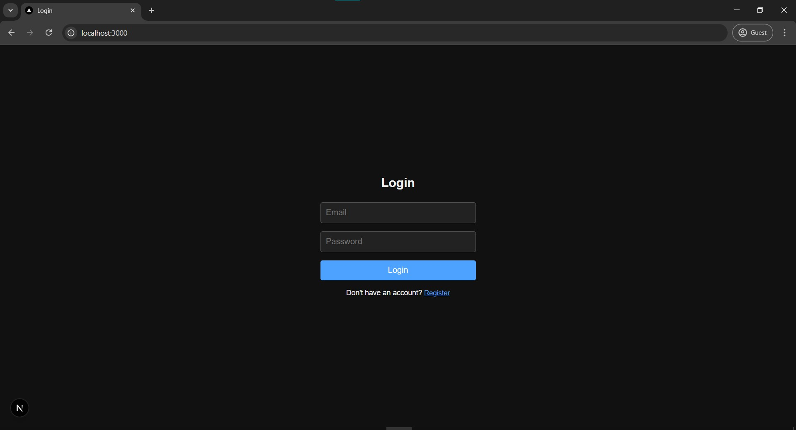
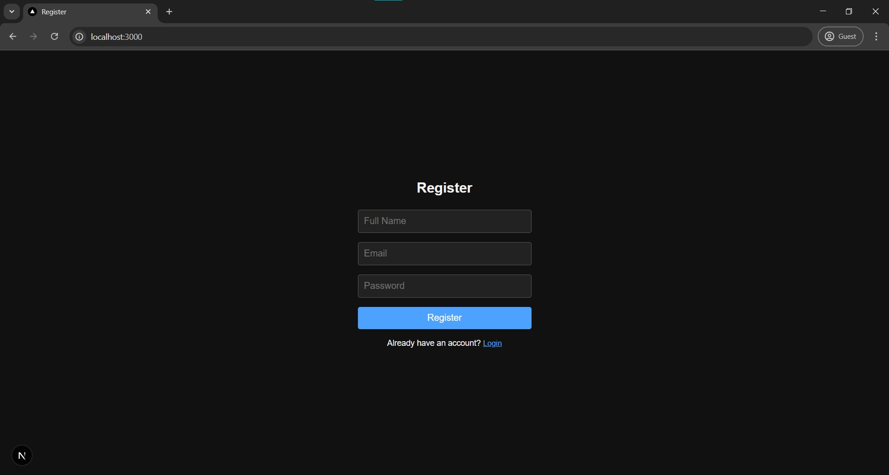
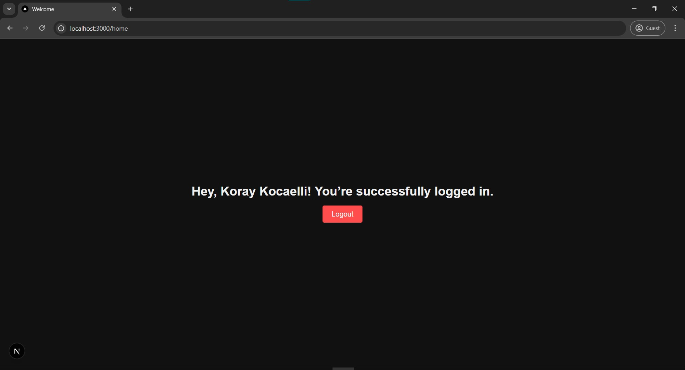

# Next.js + Firebase Authentication App

This project is a simple authentication system built with **Next.js**, **TypeScript**, and **Firebase Authentication**.

## 🚀 Features

- 🔐 Register and Login with Firebase Auth (Email/Password)
- 👋 Personalized greeting with user's full name after login
- 🔁 Logout functionality with redirect to login page
- ⚙️ Loading screen during authentication state check
- 💅 Clean and responsive UI with inline styling
- 🕹️ Fully functional and ready to deploy

## 🛠️ Technologies Used

- Next.js (App Router, TypeScript)
- Firebase Authentication
- React Hooks (useState, useEffect, useRouter)

## 📸 Screenshots

| Login | Register | Home |
|-------|----------|------|
|  |  |  |

## 📦 How to Run Locally

1. Clone the repository:

```bash
git clone https://github.com/koraykocaelli/next-firebase-auth-app.git
cd next-firebase-auth-app
```
2. Install dependencies:
```bash
npm install
```
3. Start the development server:
```bash
npm run dev
```
🔧 Firebase Configuration

To enable authentication, you must connect your Firebase project:

    Go to Firebase Console

    Create a new project (or select an existing one)

    Navigate to Build → Authentication → Sign-in method

    Enable Email/Password as a sign-in provider

    Go to Project Settings → General → Your Apps

    Add a new Web App and copy your Firebase config

    Replace the contents of lib/firebaseConfig.ts with:

    const firebaseConfig = {
    apiKey: "YOUR_API_KEY",
    authDomain: "YOUR_PROJECT_ID.firebaseapp.com",
    projectId: "YOUR_PROJECT_ID",
    storageBucket: "YOUR_PROJECT_ID.appspot.com",
    messagingSenderId: "YOUR_SENDER_ID",
    appId: "YOUR_APP_ID"
    };

✅ The goal was to build a clean and functional authentication system. It can be easily extended for larger applications.